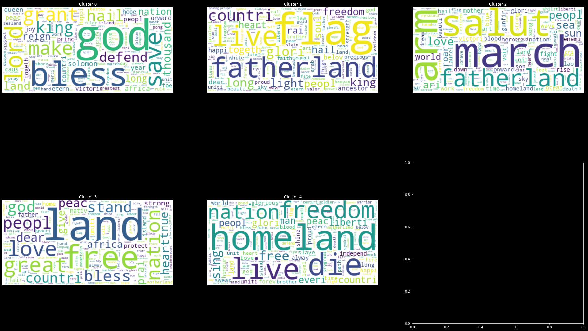
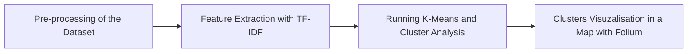

## National Anthem Clustering with K-Means

This project is inspired from the project done by Lucas de Sá

Medium Post about this project : https://medium.com/@lucasdesa/text-clustering-with-k-means-a039d84a941b

Github Repository : https://github.com/lucas-de-sa/national-anthems-clustering

Dataset of National anthems: https://www.kaggle.com/datasets/lucasturtle/national-anthems-of-the-world?resource=download

Word clouds:

IF any error in installing the dependencies:

> pip install pipwin
>
> pipwin install gdal
>
> pipwin install fiona
>
> pip install geopandas

Flow chart of how this is gonna work:

